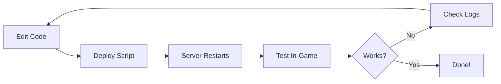

# Soul SMP - Quick Navigation

> **TL;DR:** Start with [README.md](README.md), then explore based on your role below.

---

## 🎯 I Want To...

### Build & Deploy
```bash
cd scripts && ./deploy_plugin.sh
```
**Details:** [docs/DEPLOYMENT.md](docs/DEPLOYMENT.md)

### Understand the Project
- **Overview:** [README.md](README.md)
- **File Layout:** [docs/PROJECT-STRUCTURE.md](docs/PROJECT-STRUCTURE.md)
- **What's Done:** [docs/PHASE3-COMPLETE.md](docs/PHASE3-COMPLETE.md)

### Configure the Plugin
- **Config Reference:** [docs/configuration.md](docs/configuration.md)
- **Soul Catalog:** [docs/catalog.md](docs/catalog.md)

### Use Commands
- **Command Reference:** [docs/commands.md](docs/commands.md)
- **UI Examples:** [docs/ui-examples.md](docs/ui-examples.md)

### View Design Docs
- **Master Roadmap:** [plans/roadmaps/soul-smp-master-roadmap.md](plans/roadmaps/soul-smp-master-roadmap.md)
- **System Architecture:** [plans/system architecture.md](plans/system%20architecture.md)

### Edit Code
```bash
cd plugin/src/main/java/dev/soulsmp/
```
**Structure:** [docs/PROJECT-STRUCTURE.md](docs/PROJECT-STRUCTURE.md)

---

## 📂 Key Directories

| Path | What's Inside | Go Here When... |
|------|---------------|-----------------|
| [`/docs`](docs/) | Documentation | You need reference material |
| [`/plans`](plans/) | Design specs | Planning features or balancing |
| [`/plugin`](plugin/) | Java source | Writing/debugging code |
| [`/scripts`](scripts/) | Build tools | Building or deploying |
| [`/server`](server/) | Test server | Testing in-game |

---

## 🚀 Common Tasks

### Make a Code Change
1. Edit file in `plugin/src/main/java/`
2. Run `scripts/deploy_plugin.sh`
3. Test in-game

### Add a Soul
1. Design in `plans/spec/souls/<name>/`
2. Implement in `plugin/src/main/java/dev/soulsmp/<name>/`
3. Add to `config.yml` souls catalog
4. Deploy and test

### Update Config
1. Edit `plugin/src/main/resources/config.yml` (default)
2. Or edit `server/plugins/SoulSMP/config.yml` (runtime)
3. Run `/souls reload` in-game

### View Logs
```bash
tail -f server/logs/latest.log
```

---

## 📖 Documentation Hub

**Start here:** [docs/README.md](docs/README.md) - Full documentation index

**Quick links:**
- [Commands](docs/commands.md)
- [Configuration](docs/configuration.md)
- [Deployment](docs/DEPLOYMENT.md)
- [Project Structure](docs/PROJECT-STRUCTURE.md)

---

## 🎮 Testing Workflow



**In practice:**
```bash
# Terminal 1: Deploy & run
cd scripts && ./deploy_plugin.sh

# Terminal 2: Watch logs
tail -f ../server/logs/latest.log

# In-game: Test commands
/souls list
```

---

**More:** See [README.md](README.md) for full project overview.
